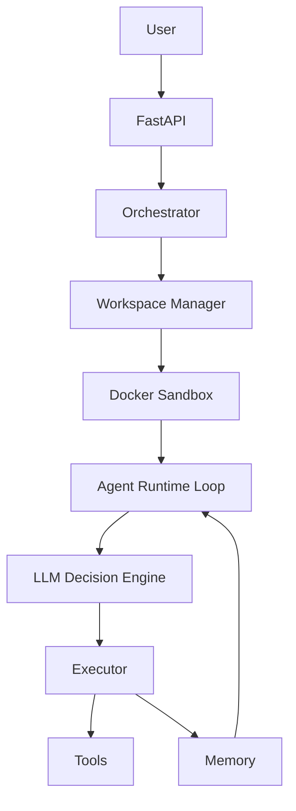
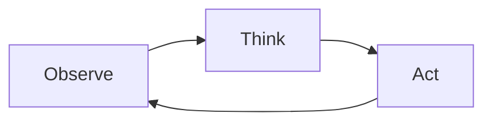

# AI Coding Orchestrator

An autonomous coding agent framework — similar in spirit to Devin or Cursor — built around a real execution loop, Docker sandboxing, and LLM-driven tool use.

This is **v0.1**: the infrastructure is complete, but the agent can't touch code yet. That comes in Phase 2.

---

## What it does

You submit a task via API. The agent takes it from there:

1. Receives the task goal
2. Asks an LLM what to do next
3. Executes a tool inside a Docker sandbox
4. Observes the result
5. Updates its memory
6. Repeats until done (or hits the iteration limit)

It's the same basic loop most serious agent systems use.

---

## Architecture


---

## Features

### Task API

Submit tasks over HTTP:
```http
POST /tasks
{
  "goal": "run tests"
}
```

Agent execution runs in a background task so the API stays responsive.

### Docker Sandbox

Each task gets its own container (`agent_ws_<task_id>`), keeping execution isolated and reproducible. Commands run via `docker exec`.

### Agent Loop

The core loop lives in `agent_runtime/agent_loop.py`:


### LLM Decision Engine

Uses a local model via Ollama. Each step, the model gets the task goal, recent history, and available tools, then returns a structured JSON decision:
```json
{
  "tool": "run_tests",
  "input": "",
  "done": false
}
```

Malformed responses are retried automatically.

### Tool System

Tools are registered in a central registry and called dynamically based on LLM decisions. The current tool: `run_tests`.

### Memory

The agent tracks its goal, decision history, and observations. All of it gets injected into each LLM prompt so the model has context for what it's already tried.

---

## Example output
```
Step 0 | Decision: {'tool': 'run_tests'}
Result: 1 passed

Step 1 | Decision: {'done': true}
```

---

## Repo structure
```
ai-orchestrator/
├── backend/
│   └── app/
│       ├── api/
│       ├── config/
│       ├── models/
│       ├── orchestrator/
│       ├── workspace/
│       ├── memory/
│       ├── llm/
│       ├── tools/
│       └── logging/
├── agent_runtime/
├── sandbox/
│   └── docker/
└── workspaces/
```

---

## Running it

**1. Install dependencies**
```bash
pip install -r backend/requirements.txt
```

**2. Build the sandbox image**
```bash
docker build -t agent-sandbox sandbox/docker
```

**3. Start the API**
```bash
cd backend
uvicorn app.main:app --reload
```

Open `http://127.0.0.1:8000/docs` and submit a task.

---

## Current limitations

The agent can't read or modify code yet. These tools aren't implemented:

| Tool | Purpose |
|------|---------|
| `list_directory` | Browse the repo |
| `read_file` | Read source files |
| `write_file` | Make edits |
| `git_diff` | Review changes |
| `git_commit` | Commit work |

Without them, the agent can run commands but has no idea what's in the repo.

---

## Roadmap

| Phase | Focus | Details |
|-------|-------|---------|
| **Phase 2** | Repo awareness | List files, read source, analyze failing tests, build repo context |
| **Phase 3** | Code modification | Edit files, generate patches, rerun tests |
| **Phase 4** | Multi-agent | Coding agent + reviewer agent + human approval gate |

---

## License

MIT
